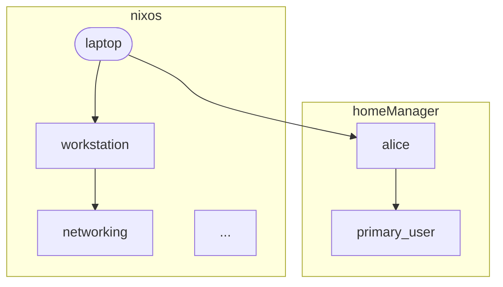

# Trace Demo Template — Design

**Date:** 2026-04-08
**Status:** Approved for implementation
**Depends on:** All SF1-SF5 merged (adapter accumulation, identity preservation, provider provenance, context adapters, forward consumption)

## Goal

Create `templates/trace-demo/` — a demo template that recreates the POC's `transform-trace-demo` using the current adapter-based architecture. Demonstrates excludes, substitutions, and Mermaid trace visualization, all expressed as `meta.adapter` composition rather than the POC's bespoke `resolve'`/`transforms` system.

Doubles as a tutorial for custom adapter authoring.

## Design Decisions

| Decision | Choice | Rationale |
|---|---|---|
| Exclude visualization | Tombstone aspects via `mapAspect` | Empty aspects with `meta.excluded = true` survive `filterIncludes`, visible to trace adapter, no-op for build |
| Substitution visualization | Two entries (tombstone + replacement) | Tombstone carries `meta.replacedBy`, includes the replacement as child — renderer draws dashed line to tombstone and edge to replacement |
| Adapter location | Template-local in trace.nix | Shows users how to write custom adapters. Extract to core later if pattern proves reusable |
| Trace resolution | Document both approaches | Approach A (separate pass) for the actual rendering; Approach B (composed with module) documented as advanced pattern |
| File output | `mightyiam/files` | Consistent with flake-parts-modules template; end-users copying the example will want this pattern |
| Multi-class | Resolve per-class, merge traces | Alice has both nixos + homeManager keys, triggers subgraph rendering |
| Testing | `just check trace-demo` only | Template rendering exercises the whole pipeline. Separate CI tests only needed if adapters are extracted to core |

## Template Structure

```
templates/trace-demo/
  flake.nix                     # inputs: den, nixpkgs, import-tree, files
  modules/
    den.nix                     # schema, hosts/users, __findFile
    files.nix                   # imports files flakeModule, perSystem write-files + trace packages
    trace.nix                   # adapter helpers, trace adapter, Mermaid renderer
    aspects/
      defaults.nix              # stateVersion, hostname, define-user stubs
      hosts/
        laptop.nix              # workstation, user alice — baseline (no adapters)
        desktop-gdm.nix         # workstation + substituteTrace regreet→gdm
        web-server.nix          # server + extra providers — no filtering
        mail-relay.nix          # relay + excludeTrace monitoring by name
        devbox.nix              # workstation+server, excludeTrace tailscale
        provider-filter.nix     # server + excludeTrace by meta.provider prefix
        angle-brackets.nix      # <den/...> includes + excludeTrace to show composition
      roles/
        workstation.nix         # includes: networking, tailscale, desktop
        server.nix              # includes: networking, monitoring, monitoring._.node-exporter,
                                #   monitoring._.nginx-exporter, monitoring._.alerting, tailscale
        relay.nix               # includes: server, mail
      features/
        networking.nix
        tailscale.nix
        desktop.nix             # includes: regreet
        greeters.nix            # regreet, gdm, sddm as separate aspects
        monitoring.nix          # provides: node-exporter, nginx-exporter, alerting
        mail.nix                # parametric { host, ... }: uses host context
      users/
        alice.nix               # includes <den/primary-user>, has both nixos + homeManager keys
        deploy.nix              # nixos-only system user
  traces/                       # Generated by nix run .#write-files
```

## Hosts

| Host | Adapter pattern | Notes |
|---|---|---|
| laptop | none | Baseline — full tree, both nixos + homeManager via alice |
| desktop-gdm | `substituteTrace "regreet" den.aspects.gdm` | Tombstone for regreet, replacement gdm as child |
| web-server | none | Monitoring providers visible in trace, user deploy (nixos only) |
| mail-relay | `excludeTrace (a: a.name == "monitoring")` | Exclude by name |
| devbox | `excludeTrace (a: a.name == "tailscale")` | Exclude across two role trees (workstation + server) |
| provider-filter | `excludeTrace (a: lib.take 1 (a.meta.provider or []) == ["monitoring"])` | Exclude by `meta.provider` list prefix |
| angle-brackets | `excludeTrace (a: a.name == "tailscale")` | `<den/...>` bracket includes compose with adapters |

## Adapter Helpers

Template-local in `trace.nix`. Both are thin wrappers over `adapters.mapAspect`.

### excludeTrace

Replaces matched aspects with empty tombstones carrying exclusion metadata:

```nix
excludeTrace = pred: adapters.mapAspect (a:
  if pred a then {
    name = a.name or "<anon>";
    meta = (a.meta or {}) // { excluded = true; };
  } else a
);
```

Usage on host aspects:

```nix
den.aspects.mail-relay = {
  includes = [ den.aspects.relay ];
  meta.adapter = inherited: excludeTrace (a: a.name == "monitoring") inherited;
};
```

### substituteTrace

Replaces matched aspect with a tombstone that includes the replacement as a child:

```nix
substituteTrace = name: replacement: adapters.mapAspect (a:
  if a.name == name then {
    inherit (a) name;
    meta = (a.meta or {}) // { excluded = true; replacedBy = replacement.name or "<anon>"; };
    includes = [ replacement ];
  } else a
);
```

The tombstone has no class modules (no `nixos`/`homeManager` keys), so it contributes nothing to the build. The replacement, as its child, flows through normally.

Usage:

```nix
den.aspects.desktop-gdm = {
  includes = [ den.aspects.workstation ];
  meta.adapter = inherited: substituteTrace "regreet" den.aspects.gdm inherited;
};
```

### Subtree behavior on exclusion

When `excludeTrace` matches an aspect that has `includes` (e.g., a role), the tombstone drops the entire subtree — children are not traced. This is intentional: excluding a role means excluding everything it composes. The trace shows the tombstone node but none of its children, which accurately represents what the build would produce.

### Why mapAspect instead of filter

`adapters.filter` returns `{}` for excluded aspects, causing `filterIncludes` to drop them entirely — they vanish from the trace. `mapAspect` transforms the aspect in-place, so the tombstone survives `filterIncludes`'s `keeps` check (it returns non-`{}` from the inner adapter) while contributing no modules to the build.

## Trace Adapter

### Approach A: Separate pass (primary)

Standalone adapter for `resolve.withAdapter`. Collects a flat list of trace entries. Used for actual trace rendering.

```nix
traceAdapter = { aspect, recurse, class, aspect-chain, ... }:
  let
    meaningful = name: name != "<anon>" && name != "<function body>" && !(lib.hasPrefix "[definition " name);
    parent =
      let m = builtins.filter meaningful (map (a: a.name or "<anon>") aspect-chain);
      in if m == [] then null else lib.last m;
    entry = {
      name = aspect.name or "<anon>";
      provider = aspect.meta.provider or [];
      excluded = aspect.meta.excluded or false;
      replacedBy = aspect.meta.replacedBy or null;
      inherit class parent;
    };
    childTraces = lib.concatMap (i: (recurse i).trace or []) (aspect.includes or []);
  in
  { trace = [ entry ] ++ childTraces; };
```

Each entry carries a `parent` field derived from the aspect-chain, which the Mermaid renderer uses to construct edges. The `parent` is the last meaningful name in the chain (filtering `<anon>`, `<function body>`, `[definition ...]`).

Invoked as:

```nix
den.lib.aspects.resolve.withAdapter (adapters.filterIncludes traceAdapter) class hostAspect
```

Must wrap with `filterIncludes` so `meta.adapter` on aspects is honored — without it, `excludeTrace`/`substituteTrace` have no effect since they rely on `meta.adapter` being composed by `filterIncludes`.

### Approach B: Composed with module (documented)

Piggybacks on the module adapter, collecting trace entries alongside `{ imports }`. Documented in `trace.nix` as a comment block showing the advanced pattern.

```nix
traceModule = { aspect, recurse, class, classModule, aspect-chain, ... }:
  let
    meaningful = name: name != "<anon>" && name != "<function body>" && !(lib.hasPrefix "[definition " name);
    parent =
      let m = builtins.filter meaningful (map (a: a.name or "<anon>") aspect-chain);
      in if m == [] then null else lib.last m;
    entry = {
      name = aspect.name or "<anon>";
      provider = aspect.meta.provider or [];
      excluded = aspect.meta.excluded or false;
      replacedBy = aspect.meta.replacedBy or null;
      inherit class parent;
    };
    childResults = map (i: recurse i) (aspect.includes or []);
    childImports = lib.concatMap (r: r.imports or []) childResults;
    childTraces = lib.concatMap (r: r.trace or []) childResults;
  in
  {
    imports = classModule ++ childImports;
    trace = [ entry ] ++ childTraces;
  };
```

**Gotcha (document this):** Must use `filterIncludes traceModule`, not compose atop `adapters.default`. The default adapter's `recurse` only returns `{ imports }`, so child trace entries are lost. The trace data must flow through the same recurse path.

## Multi-Class Trace Resolution

`resolve.withAdapter` takes a single class. To produce multi-class Mermaid diagrams (e.g., laptop with alice spanning nixos + homeManager):

```nix
traceHost = hostName: hostAspect:
  let
    classes = [ "nixos" "homeManager" ];
    resolve' = adapters.filterIncludes traceAdapter;
    traceFor = class:
      (den.lib.aspects.resolve.withAdapter resolve' class hostAspect).trace or [];
    merged = lib.concatMap traceFor classes;
  in
  traceToMermaid hostName merged;
```

Entries carry their `class` field. The renderer groups edges into subgraphs when multiple classes appear. Hosts where all aspects are nixos-only get flat graphs. Hosts with alice (who has both nixos and homeManager keys) show both subgraphs.

## Mermaid Renderer

~200 lines in `trace.nix`. Takes a host name and merged trace entry list, produces a `graph TD` string.

### Node styling

| Node type | Condition | Mermaid syntax |
|---|---|---|
| Host root | First entry matching host name | `([name]):::host` — green rounded |
| Normal | `excluded = false` | `[name]` — default rectangle |
| Provider-qualified | `provider != []` | Label: `monitoring/node-exporter` |
| Excluded tombstone | `excluded = true`, `replacedBy = null` | `[name]:::excluded` — red dashed border |
| Replaced tombstone | `excluded = true`, `replacedBy != null` | `[name]:::replaced` — yellow dashed border |

### Edge styling

| Edge type | Condition | Mermaid arrow |
|---|---|---|
| Normal include | Not excluded | `-->` solid |
| To excluded | Target is excluded tombstone | `-.-x` dashed with X |
| Tombstone to replacement | From tombstone to its replacement child | `-.->` dashed arrow |

### Class definitions

```mermaid
classDef host fill:#4a9,stroke:#2d7,color:#fff,font-weight:bold
classDef excluded fill:#f99,stroke:#f00,stroke-dasharray: 5 5
classDef replaced fill:#ff9,stroke:#fa0,stroke-dasharray: 5 5
```

### Multi-class subgraphs

When entries span >1 class, edges are grouped:



Single-class hosts render as flat graphs without subgraphs.

### Edge construction

Edges are derived from the `parent` field on each trace entry (set by the trace adapter from `aspect-chain`). For each entry where `parent != null`, an edge is emitted from `parent → name` with styling based on `excluded`/`replacedBy`.

### Deduplication

- **Nodes:** by display name (qualified with provider path), preferring provider-tagged entries over plain
- **Edges:** by `from→to:class` key, preferring non-excluded edges over excluded
- **Self-edges:** dropped

## Aspect Hierarchy

```
workstation ─── networking
            ├── tailscale
            └── desktop ─── regreet

server ─── networking
       ├── monitoring ─┬─ _.node-exporter
       │               ├─ _.nginx-exporter
       │               └─ _.alerting
       └── tailscale

relay ─── server (full subtree)
      └── mail ({ host, ... }: parametric)
```

### Feature aspects

All feature aspects are stubs (minimal `nixos` module bodies) — the demo is about the resolution trace, not real NixOS config.

The POC's `metrics-forward` feature is intentionally omitted — forward consumption is demonstrated in SF5 and the flake-parts-modules template. This demo focuses on adapter composition patterns.

**monitoring.nix** uses `provides` to create provider sub-aspects:

```nix
den.aspects.monitoring = {
  nixos = { ... }: { /* base monitoring stub */ };
  provides.node-exporter.nixos = { ... }: { /* stub */ };
  provides.nginx-exporter.nixos = { ... }: { /* stub */ };
  provides.alerting.nixos = { ... }: { /* stub */ };
};
```

**mail.nix** is parametric to demonstrate that parametric aspects work with the trace adapter:

```nix
den.aspects.mail = { host, ... }: {
  nixos = { ... }: { /* uses host.hostName */ };
};
```

### Users

**alice** — dual-class, triggers multi-class subgraph rendering:

```nix
den.aspects.alice = {
  includes = [ <den/primary-user> ];
  nixos = { ... }: { users.users.alice.isNormalUser = true; };
  homeManager = { pkgs, ... }: { home.packages = [ pkgs.git ]; programs.fish.enable = true; };
};
```

**deploy** — nixos-only minimal user:

```nix
den.aspects.deploy = {
  nixos = { ... }: { users.users.deploy = { isSystemUser = true; group = "deploy"; }; };
};
```

## File Output

`files.nix` imports `inputs.files.flakeModules.default` and defines:

- `perSystem.files.files` — one entry per host trace (`traces/trace-{name}.md`) plus `README.md` with all traces embedded
- `perSystem.packages.write-files = config.files.writer.drv`
- Individual `perSystem.packages.trace-{name}` derivations via `writeText`

## Verification

- `just check trace-demo` — flake check with `--override-input den .`
- `nix run ./templates/trace-demo#write-files` — generates trace files and README
- Visual inspection of generated Mermaid diagrams

### Key risk to verify early

`filterIncludes` composes `meta.adapter` with its inner adapter, then checks `composed(args) != {}` to decide whether to keep each include. With `traceAdapter` as the inner adapter, tombstones (from `excludeTrace`/`substituteTrace`) should produce `{ trace = [...]; }` which is `!= {}`, so they survive. This must be verified in the first implementation step before building out the full template.

## What This Demonstrates for Users

1. **Custom adapter authoring** — `excludeTrace` and `substituteTrace` show how to build domain-specific adapters from `mapAspect`
2. **Adapter composition** — `meta.adapter = inherited: myAdapter inherited` chaining pattern
3. **Trace/introspection** — `resolve.withAdapter` with a non-module adapter to extract metadata from the aspect tree
4. **Provider filtering** — `meta.provider` list prefix matching for structural exclusion
5. **Tombstone pattern** — empty aspects as metadata carriers that are transparent to the build
6. **Multi-class resolution** — resolving the same aspect tree for different classes and merging results
7. **mightyiam/files** — file generation and `write-files` pattern
8. **Angle brackets** — `<den/...>` syntax composes correctly with adapters
9. **Separate vs composed adapters** — both approaches documented with trade-offs
